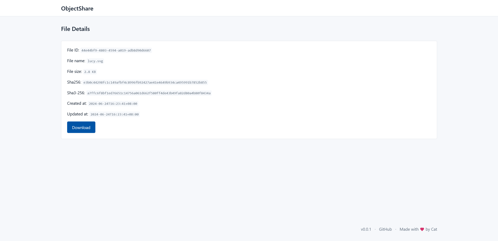

# ObjectShare

Run a file sharing site in minutes.

## Preview

## Tech Stack

- Go 1.22 - Programming language
- chi v5 - Http router
- Htmx v2 - Frontend "framework"
- Postgres v16 - Database

## Usage

WiP

## Features

- [x] File upload
- [x] File download
- [ ] Better upload UI
- [ ] File sharing & permission
- [ ] File deletion
- [ ] User management
- [ ] User authentication
- [ ] User authorization
- [ ] Server-side encryption & decryption
- [ ] Client-side encryption & decryption

## Supported Object Storage Services

- [x] Cloudflare R2
- [ ] AWS S3
- [ ] Backblaze B2
- [ ] Alibaba Cloud OSS
- [ ] Tencent Cloud COS
- [ ] Google Cloud Storage
- [ ] Oracle Cloud Object Storage
- [ ] Microsoft Azure Blob Storage

## License

[GPL-3.0](./LICENSE)

## Star History

