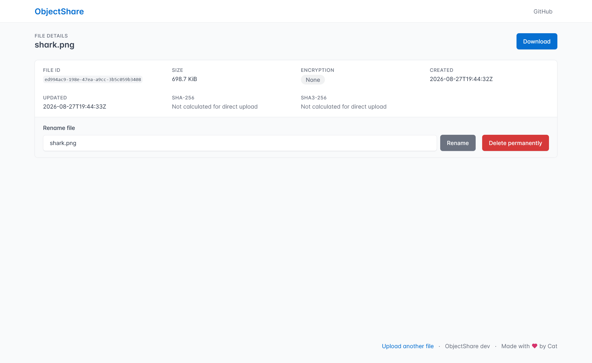

# ObjectShare

ObjectShare is a small self-hosted file sharing service written in Go. Files are shared through unlisted UUID links; the uploading browser receives an HTTP-only owner token that permits rename and deletion.

## Preview



## Features

- Streaming, size-limited uploads with SHA-256 and SHA3-256 checksums
- Tabler UI with HTMX progressive enhancement and native-form fallbacks
- Filesystem, Cloudflare R2, AWS S3, Backblaze B2, Alibaba Cloud OSS, or Tencent Cloud COS object storage
- Direct-to-object-storage uploads that avoid reverse-proxy request-body limits
- PostgreSQL metadata with bounded connection pools
- Optional AES-256-GCM server-side encryption at rest
- Owner-only rename and permanent deletion
- Graceful shutdown, health endpoints, secure response headers, and structured logs
- Multi-stage, non-root, read-only container image
- Docker Compose development/single-node deployment
- CI, vulnerability scanning, SBOM/provenance, and multi-architecture publishing to Docker Hub and GHCR

ObjectShare does not provide user accounts or access-controlled downloads. Anyone with a file URL can download it. Put it behind an authentication-aware reverse proxy if private sharing is required.

## Roadmap

- [x] File upload
- [x] File download
- [ ] Better upload UI
- [ ] File sharing & permission
- [x] File deletion
- [ ] User management
- [ ] User authentication
- [ ] User authorization
- [x] Server-side encryption & decryption
- [ ] Client-side encryption & decryption

HTMX is intentionally part of the frontend architecture. The native forms are accessibility and no-JavaScript fallbacks; planned login, account, permission, and user-management interactions will use HTMX progressive enhancement.

### Supported Object Storage Services

- [x] Cloudflare R2
- [x] AWS S3
- [x] Backblaze B2
- [x] Alibaba Cloud OSS
- [x] Tencent Cloud COS
- [ ] Google Cloud Storage
- [ ] Oracle Cloud Object Storage
- [ ] Microsoft Azure Blob Storage

## Quick start with Docker Compose

```sh
cp .env.example .env
# Edit .env and replace POSTGRES_PASSWORD.
docker compose up --build -d
```

Open <http://localhost:8080>. Compose uses PostgreSQL 18 and a persistent local object volume. Stop it with `docker compose down`; add `--volumes` only when you intentionally want to delete all stored data.

For HTTPS deployments, terminate TLS at a reverse proxy and set `OBJECTSHARE_SECURE_COOKIES=true`. Back up both named volumes together so metadata and objects remain consistent.

## Run from source

Requirements: Go 1.27 and PostgreSQL 18 (PostgreSQL 17 is also supported).

```sh
cp config.json.example config.json
# Edit database credentials and storage settings.
go run . -config config.json
```

Configuration is read from the optional JSON file and then overridden by `OBJECTSHARE_*` environment variables. A config file is not required when all settings are supplied through the environment. The most useful variables are:

| Variable | Default | Purpose |
| --- | --- | --- |
| `OBJECTSHARE_ADDRESS` | `:8080` | HTTP listen address |
| `OBJECTSHARE_MAX_FILE_SIZE_MB` | `100` | Per-file upload limit |
| `OBJECTSHARE_STORAGE_SERVICE` | `filesystem` | `filesystem`, `r2`, `s3`, `b2`, `oss`, or `cos` |
| `OBJECTSHARE_STORAGE_PATH` | `data/objects` | Filesystem object directory |
| `OBJECTSHARE_DB_*` | varies | PostgreSQL connection and pool settings |
| `OBJECTSHARE_SECURE_COOKIES` | `false` | Require HTTPS for owner cookies |
| `OBJECTSHARE_ENCRYPTION_ENABLED` | `false` | Enable encryption at rest |
| `OBJECTSHARE_ENCRYPTION_KEY` | empty | Base64/hex encoded 32-byte key |

Generate an encryption key with `openssl rand -base64 32`. Losing or changing this key makes existing encrypted files unrecoverable. Encrypted objects are authenticated before download and are held in memory during encryption/decryption. To bound memory use, encrypted mode limits files to 128 MiB and permits one cryptographic operation per application replica at a time.

### Object storage

All five object-storage providers use private buckets and the S3 API. When server-side encryption is disabled, JavaScript-enabled browsers upload directly to a short-lived URL bound to one object key, exact size, and content type. ObjectShare creates a pending database record first, then verifies the stored object's size and content type before publishing its share page. Expired or aborted pending uploads are removed. Only authorization and completion requests pass through ObjectShare, so a reverse proxy or CDN in front of the app does not carry the file body.

Downloads use short-lived presigned URLs unless ObjectShare server-side encryption is enabled. The direct path cannot provide application-verified SHA checksums because ObjectShare never receives the file bytes; the details page labels those checksums as unavailable. Encryption and direct upload are intentionally mutually exclusive because encryption keys remain on the server.

Grant the configured identity only read, write, and delete access to the selected bucket. Do not grant account-wide bucket administration. Direct uploads require a bucket CORS rule allowing the exact public ObjectShare origin, the `PUT` method, and the `Content-Type` header. The S3-style equivalent is:

```json
[
  {
    "AllowedOrigins": ["https://share.example.com"],
    "AllowedMethods": ["PUT"],
    "AllowedHeaders": ["Content-Type"],
    "MaxAgeSeconds": 3600
  }
]
```

Use the provider console's equivalent fields when it does not accept S3 CORS JSON directly. Add a separate localhost origin for local browser testing. Avoid wildcard origins for private buckets.

Presigned download timeouts default to `10m`; upload timeouts default to `1h`. Configure them with `OBJECTSHARE_<PROVIDER>_PRESIGN_TIMEOUT` and `OBJECTSHARE_<PROVIDER>_UPLOAD_PRESIGN_TIMEOUT`, replacing `<PROVIDER>` with `R2`, `S3`, `B2`, `OSS`, or `COS`. Both support a maximum of `168h`. Single-part direct uploads are capped at 5 GiB; larger objects require multipart upload support, which ObjectShare does not currently implement.

#### Cloudflare R2

Set `OBJECTSHARE_STORAGE_SERVICE=r2` and provide:

- `OBJECTSHARE_R2_BUCKET_NAME`
- `OBJECTSHARE_R2_ACCOUNT_ID`
- `OBJECTSHARE_R2_ACCESS_KEY_ID`
- `OBJECTSHARE_R2_SECRET_ACCESS_KEY`
- `OBJECTSHARE_R2_PRESIGN_TIMEOUT` (default `10m`, maximum `168h`)
- `OBJECTSHARE_R2_UPLOAD_PRESIGN_TIMEOUT` (default `1h`, maximum `168h`)

An account ID produces the standard `https://<account-id>.r2.cloudflarestorage.com` endpoint. `OBJECTSHARE_R2_ENDPOINT` remains available for an explicit HTTPS endpoint. See Cloudflare's [R2 limits](https://developers.cloudflare.com/r2/platform/limits/) and [upload guidance](https://developers.cloudflare.com/r2/objects/upload-objects/).

#### Amazon S3

Set `OBJECTSHARE_STORAGE_SERVICE=s3`, `OBJECTSHARE_S3_BUCKET_NAME`, and `OBJECTSHARE_S3_REGION`. Authentication uses the AWS SDK default credential chain when `OBJECTSHARE_S3_ACCESS_KEY_ID` and `OBJECTSHARE_S3_SECRET_ACCESS_KEY` are empty, so IAM roles and workload credentials are preferred. For explicit temporary credentials, also set `OBJECTSHARE_S3_SESSION_TOKEN`.

`OBJECTSHARE_S3_ENDPOINT` is optional and supports HTTPS S3-compatible endpoints. Set `OBJECTSHARE_S3_USE_PATH_STYLE=true` only when that endpoint requires path-style addressing; native S3 uses virtual-hosted style by default.

See AWS's [Go v2 presigned upload example](https://docs.aws.amazon.com/sdk-for-go/v2/developer-guide/go_s3_code_examples.html) and [S3 CORS guide](https://docs.aws.amazon.com/AmazonS3/latest/userguide/enabling-cors-examples.html).

#### Backblaze B2

Set `OBJECTSHARE_STORAGE_SERVICE=b2` and provide `OBJECTSHARE_B2_BUCKET_NAME`, `OBJECTSHARE_B2_REGION`, `OBJECTSHARE_B2_ACCESS_KEY_ID`, and `OBJECTSHARE_B2_SECRET_ACCESS_KEY`. The endpoint defaults to `https://s3.<region>.backblazeb2.com`; override it with `OBJECTSHARE_B2_ENDPOINT` only when necessary. Use a bucket-restricted B2 application key, not the master application key.

See Backblaze's [S3-compatible API endpoint guide](https://www.backblaze.com/docs/cloud-storage-call-the-s3-compatible-api) and [CORS rules](https://www.backblaze.com/docs/cloud-storage-cross-origin-resource-sharing-rules).

#### Alibaba Cloud OSS

Set `OBJECTSHARE_STORAGE_SERVICE=oss` and provide `OBJECTSHARE_OSS_BUCKET_NAME`, `OBJECTSHARE_OSS_REGION`, `OBJECTSHARE_OSS_ACCESS_KEY_ID`, and `OBJECTSHARE_OSS_SECRET_ACCESS_KEY`. The AWS-SDK-compatible endpoint defaults to `https://s3.oss-<region>.aliyuncs.com`; `OBJECTSHARE_OSS_ENDPOINT` can select another S3-compatible OSS service endpoint, such as `https://s3.oss-<region>-internal.aliyuncs.com`. OSS requires virtual-hosted-style requests, so path style is not offered. Alibaba's bucket-bound CNAME mode is not an S3 service endpoint and is not accepted here. New OSS users accessing buckets in Chinese mainland regions should confirm their account's current endpoint eligibility before deployment.

See Alibaba Cloud's [AWS SDK compatibility guide](https://www.alibabacloud.com/help/en/oss/developer-reference/use-aws-sdks-to-access-oss), [region endpoints](https://www.alibabacloud.com/help/en/oss/user-guide/regions-and-endpoints), and [CORS guide](https://www.alibabacloud.com/help/en/oss/user-guide/configure-cross-origin-resource-sharing/).

#### Tencent Cloud COS

Set `OBJECTSHARE_STORAGE_SERVICE=cos` and provide `OBJECTSHARE_COS_BUCKET_NAME`, `OBJECTSHARE_COS_REGION`, `OBJECTSHARE_COS_ACCESS_KEY_ID`, and `OBJECTSHARE_COS_SECRET_ACCESS_KEY`. Use the full bucket name including its APPID suffix, such as `objectshare-1250000000`. The endpoint defaults to `https://cos.<region>.myqcloud.com`; `OBJECTSHARE_COS_ENDPOINT` can override it. Current COS buckets use virtual-hosted-style requests.

See Tencent Cloud's [S3-compatible configuration guide](https://intl.cloud.tencent.com/document/product/436/34688?lang=en) and [AWS SDK for Go v2 compatibility example](https://cloud.tencent.com/document/product/436/37421).

## Production checklist

- Put the service behind HTTPS and enable secure cookies.
- Use a long, unique PostgreSQL password and TLS (`ssl_mode=require` or stronger) for external databases.
- Keep the database private; only publish the application port.
- Use an object-storage provider for horizontally scaled deployments. Filesystem storage is intended for a single application replica.
- Persist and back up object storage and PostgreSQL consistently.
- Set upload limits and proxy timeouts deliberately; apply rate limiting at the ingress/reverse proxy.
- Keep the encryption key in a secret manager, never in `config.json` or the image.
- Monitor `/health/live` for process health and `/health/ready` for database readiness.
- Test upgrades and restores in a staging environment before production rollout.

## Container publishing

`.github/workflows/release.yml` builds downloadable Linux archives for AMD64 v1/v3, ARM64, and RISC-V. Builds are retained as workflow artifacts for pushes, pull requests, and manual runs; published GitHub Releases also receive the archives and SHA-256/SHA3-256 checksum files.

`.github/workflows/container-publish.yml` always publishes `linux/amd64` and `linux/arm64` images to GHCR on a GitHub Release and can also be run manually. Docker Hub publishing is optional; configure all three settings below to enable it:

- Variable `DOCKERHUB_USERNAME`: Docker Hub account or organization
- Variable `DOCKERHUB_IMAGE`: full image name, for example `acme/objectshare`
- Secret `DOCKERHUB_TOKEN`: a Docker Hub access token with push access

If any Docker Hub setting is absent, that login and image target are skipped and the workflow publishes to GHCR only. GHCR uses the workflow-scoped `GITHUB_TOKEN`; no additional secret is needed. Published images include BuildKit provenance and an SBOM. Package visibility is managed from the repository's Packages settings.

`.github/workflows/workflow_runs_clean_up.yml` runs daily (or manually), deletes runs older than seven days, and always retains the newest run for each workflow.

## Development

```sh
go mod verify
go test -race ./...
go vet ./...
go run golang.org/x/vuln/cmd/govulncheck@v1.7.0 ./...
```

CI also verifies formatting and builds the container. Dependency and action updates are proposed weekly by Dependabot.

## License

[GPL-3.0-only](./LICENSE)
