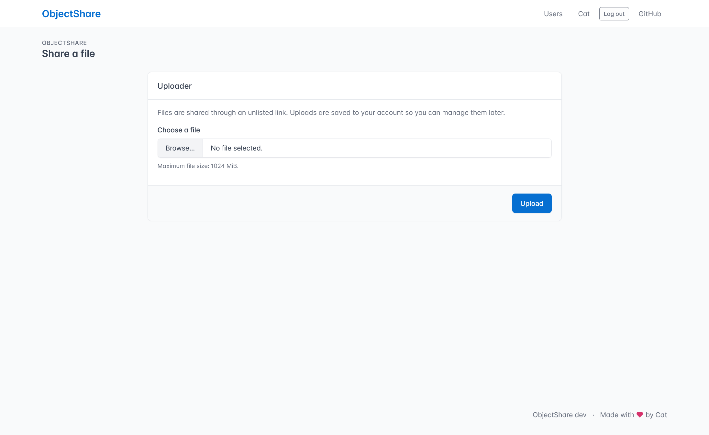

# ObjectShare

ObjectShare is a small self-hosted file sharing service written in Go. Files are shared through unlisted UUID links; the uploading browser receives an HTTP-only owner token that permits rename and deletion.

## Preview



## Features

- Single-file and multiple-file, size-limited uploads with SHA-256 and SHA3-256 checksums
- Tabler UI with HTMX progressive enhancement and native-form fallbacks
- Filesystem, Cloudflare R2, AWS S3, Backblaze B2, Alibaba Cloud OSS, or Tencent Cloud COS object storage
- Direct-to-object-storage uploads that avoid reverse-proxy request-body limits
- PostgreSQL metadata with bounded connection pools
- Optional AES-256-GCM server-side encryption at rest
- Owner-only rename and permanent deletion
- Guest uploads, database-backed per-user storage quotas, and automatic guest/unpaid file retention
- Stripe Checkout paid plans for upgraded storage, longer active-plan retention, and direct download links
- Password, Google, GitHub, and Discord login with separate user and administrator management interfaces
- Optional server-verified Turnstile protection and shared PostgreSQL request rate limits
- Encrypted PostgreSQL-backed configuration with a dedicated administrator dashboard
- One-time administrator bootstrap through the web setup or CLI
- Graceful shutdown, health endpoints, secure response headers, and structured logs
- Multi-stage, non-root, read-only container image
- Docker Compose development/single-node deployment
- CI, vulnerability scanning, SBOM/provenance, and multi-architecture publishing to Docker Hub and GHCR

File detail URLs remain unlisted rather than private. Guest and standard-account downloads must start on that details page; a stable direct download URL works only while the owning account has an active plan that includes direct links. Put ObjectShare behind an authentication-aware reverse proxy if every file view must require authentication.

## Roadmap

- [x] File upload
- [x] Single-file and multiple-file upload modes
- [x] Upload quota
- [x] CAPTCHA and API rate limiting
- [x] File download
- [x] Paid storage, retention, and direct-link plans
- [ ] Better upload UI
- [ ] File sharing & permission
- [x] File deletion
- [x] Auto file deletion after days for guest and unpaid users
- [x] User management
- [x] Administrator configuration dashboard
- [x] Third-party OAuth login support
- [x] Server-side encryption & decryption
- [ ] Client-side encryption & decryption

HTMX is intentionally part of the frontend architecture. The native forms are accessibility and no-JavaScript fallbacks; login, account, and user-management interactions use HTMX progressive enhancement, and planned permission flows will follow the same pattern.

### Supported Object Storage Services

- [x] Cloudflare R2
- [x] AWS S3
- [x] Backblaze B2
- [x] Alibaba Cloud OSS
- [x] Tencent Cloud COS
- [ ] Google Cloud Storage
- [ ] Oracle Cloud Object Storage
- [ ] Microsoft Azure Blob Storage

## Quick start with Docker Compose

```sh
cp .env.example .env
# Edit .env and replace the PostgreSQL, JWT, and settings encryption secrets.
docker compose up --build -d
```

Open <http://localhost:8080>. Compose uses PostgreSQL 18 and a persistent local object volume. Stop it with `docker compose down`; add `--volumes` only when you intentionally want to delete all stored data.

The first visit redirects to the one-time setup page. Create the initial administrator there; after that, `/setup` is locked. Administrators configure the application from **Configuration** (`/admin/settings`) and manage accounts from **Users**. Public signup is enabled by default and creates normal users.

For HTTPS deployments, terminate TLS at a reverse proxy, enable secure cookies in the configuration dashboard, save, and restart every application replica. Back up both named volumes together so metadata, encrypted configuration, and objects remain consistent.

## Run from source

Requirements: Go 1.27 and PostgreSQL 18 (PostgreSQL 17 is also supported).

```sh
cp config.json.example config.json
# Edit the bootstrap database and secret settings.
go run . -config config.json
```

ObjectShare now keeps operational configuration in PostgreSQL. On the first start after this upgrade, it imports the existing JSON/environment values into one encrypted `application_settings` revision. Later starts load that database revision, so changing a legacy operational environment variable does not overwrite an administrator's dashboard changes. This one-time import preserves existing deployments; after it succeeds, manage application policy, OAuth, CAPTCHA, rate limits, storage providers, and object encryption at `/admin/settings`.

Only bootstrap settings remain file/environment-owned because they are needed before PostgreSQL configuration can be opened:

| Variable | Default | Purpose |
| --- | --- | --- |
| `OBJECTSHARE_ADDRESS` | `:8080` | HTTP listen address |
| `OBJECTSHARE_READ_TIMEOUT`, `OBJECTSHARE_WRITE_TIMEOUT`, `OBJECTSHARE_IDLE_TIMEOUT`, `OBJECTSHARE_SHUTDOWN_TIMEOUT` | varies | HTTP server lifecycle timeouts |
| `OBJECTSHARE_DB_*` | varies | PostgreSQL connection and pool settings |
| `OBJECTSHARE_JWT_SECRET` | none (required) | JWT HMAC signing secret, at least 32 random bytes |
| `OBJECTSHARE_JWT_LIFETIME` | `12h` | JWT lifetime (`5m` to `24h`) |
| `OBJECTSHARE_SETTINGS_KEY` | JWT secret for upgrade compatibility | Independent key that encrypts the database configuration document; set it before the first import and keep it stable |

Generate separate JWT and settings secrets with `openssl rand -base64 48`, provide the same values to every replica, and keep the settings key with database backups. The fallback to the JWT secret exists only so an older deployment can upgrade without a new mandatory variable; a new deployment should always set an independent `OBJECTSHARE_SETTINGS_KEY`. Losing or changing that key makes the database configuration unreadable and startup fails closed. Rotating the JWT secret invalidates every issued JWT but does not affect database configuration when the independent settings key is configured.

The dashboard stores the entire operational document as authenticated AES-GCM ciphertext. Secret inputs are write-only: an empty field preserves its stored value, while an explicit checkbox clears it. A save validates the complete candidate before one optimistic, revision-checked database update; a stale admin page cannot overwrite a newer revision. Saved changes intentionally require a restart because storage clients, encryption, OAuth, CAPTCHA CSP, cookies, and proxy trust must change as one consistent startup snapshot. Restart every replica after saving. Changing a storage provider, bucket, or filesystem path does not migrate existing objects, and changing the object-encryption key does not re-encrypt them; complete those data migrations separately before activating such changes.

The operational `OBJECTSHARE_*` variables retained in `.env.example`, Compose, and the full parser are compatibility seed inputs only. They are consulted when no database configuration row exists; the dashboard becomes authoritative once the row has been created. Existing `config.json` files remain valid and are not rewritten. After verifying the imported dashboard revision and restarting successfully, remove legacy provider, CAPTCHA, OAuth, and object-encryption secrets from the JSON/environment deployment inputs so those extra plaintext copies no longer remain available to the process.

Generate an object-encryption key separately with `openssl rand -base64 32` and enter it through the write-only dashboard field. Losing or changing that key makes existing encrypted files unrecoverable. Encrypted objects are authenticated before download and are held in memory during encryption/decryption. To bound memory use, encrypted mode limits files to 128 MiB and permits one cryptographic operation per application replica at a time.

### User and administrator management

Normal users manage their profile, password, appearance, paid plan, and account-owned uploads at `/account`. The light/dark theme choice is stored with the account, so it follows the user across browsers and is applied to every authenticated page. Administrators have dedicated `/admin/settings`, `/admin/plans`, and `/admin/users` interfaces for configuration, the purchasable plan catalog, and account management. These routes enforce the administrator role server-side and cookie-authenticated changes require the signed JWT CSRF value. The final active administrator cannot be disabled, demoted, or deleted. Disabling an account, changing its role, or resetting its password increments the account token version so every earlier JWT is rejected. Manual retention-exemption and quota changes do not invalidate JWTs because request authorization reloads current account entitlements from PostgreSQL. Deleting an account keeps its existing shared files available and converts them to anonymous uploads; those files then follow the guest retention policy if it is enabled.

Public signup is changed from the configuration dashboard. `auth.jwt_secret` and `auth.token_lifetime` remain bootstrap JSON settings and are intentionally not editable from the browser.

### Guest uploads and per-user storage quotas

Guest uploads are enabled by default. A guest receives a random per-file owner token in an HTTP-only cookie, allowing that browser to rename or delete the file without creating an account. Disable **Allow guest uploads** in the configuration dashboard and restart to require login for new uploads; existing unlisted download links and owner tokens continue to work.

Storage quota is an entitlement of an individual account. Its standard limit is stored in PostgreSQL as `users.upload_quota_bytes`; it is not selected by role and there is no guest-wide or server-wide quota setting. New accounts default to `0` (unlimited). Administrators can choose an initial quota when creating an account and change it later from `/admin/users`; the web form uses MiB while the database stores bytes. While a subscription is active, ObjectShare uses the larger of the standard account quota and the plan quota. The historical `0` value remains unlimited, so a finite paid plan never reduces a legacy unlimited account.

Remove the obsolete `guest_quota_mib`, `user_quota_mib`, `admin_quota_mib`, and `panel_quota_mib` JSON keys and the matching `OBJECTSHARE_*_UPLOAD_QUOTA_MB` environment variables when upgrading from an earlier quota implementation. ObjectShare rejects them instead of silently starting with different quota behavior.

Complete files and pending direct-upload reservations both consume that account's quota, preventing concurrent requests or multiple application replicas from overcommitting it. Reservations for the same account are serialized with a database row lock; unrelated accounts do not share a quota lock. Deleting a file, aborting a direct upload, or cleaning up an expired reservation releases its bytes. Lowering a quota below current usage blocks new reservations but does not delete existing files. Anonymous uploads are not charged to an account, so disable guest uploads when every stored object must be quota-controlled. Quotas limit stored capacity; use ingress rate limiting and, where appropriate, CAPTCHA separately to control request abuse.

The uploader offers explicit single-file and multiple-file modes. A batch accepts at most `upload.max_files_per_batch` files (default `10`, range `1`–`100`), with the configured per-file size limit applied independently. The legacy first-import environment setting is `OBJECTSHARE_MAX_FILES_PER_BATCH`. Proxied batches reserve and store each file and roll back earlier files if a later reservation or storage operation fails. Direct-to-storage batches obtain all short-lived, size/type-scoped authorizations with one server request and one CAPTCHA challenge, then verify each object before publishing it.

### Stripe paid plans

Stripe Billing is optional and disabled by default. Enable it in `/admin/settings` with the browser-visible public origin, a restricted Stripe secret key, and the endpoint signing secret. Secrets are write-only in the administrator UI: blank preserves the encrypted database value, and the explicit clear control removes it. The legacy first-import variables are:

```dotenv
OBJECTSHARE_STRIPE_ENABLED=true
OBJECTSHARE_BILLING_PUBLIC_URL=https://share.example.com
OBJECTSHARE_STRIPE_SECRET_KEY=sk_live_...
OBJECTSHARE_STRIPE_WEBHOOK_SECRET=whsec_...
```

Create recurring Prices in Stripe, then add one ObjectShare record per Price at `/admin/plans`. Each plan defines its display name/price, storage quota, retention days, direct-link entitlement, availability, and sort order. The displayed price is presentation only; Checkout always receives the trusted Stripe Price ID from PostgreSQL. Do not reuse one Price ID for multiple plans. Configure the Stripe Customer Portal for cancellation and payment-method management.

Register `https://your-origin.example/api/v1/billing/stripe/webhook` in Stripe for `customer.subscription.created`, `customer.subscription.updated`, and `customer.subscription.deleted`. ObjectShare verifies the `Stripe-Signature` against the raw body with a five-minute tolerance, records event IDs for idempotency, ignores older subscription updates, and maps the subscription's Price ID back to a server-side plan. Checkout success pages never grant access. Only a verified `active` or `trialing` subscription whose current period has not ended supplies entitlements. Restart every replica after enabling billing or rotating its secrets.

An active plan raises a finite account quota to at least the plan quota. It applies its own retention window while active; `0` plan-retention days means no age-based deletion during the active subscription. When access ends, the account immediately returns to its standard quota and unpaid retention window, so old files can become eligible during the next sweep. Existing objects are not synchronously deleted merely because the plan ends. Direct-link plans enable `GET /api/v1/download/{id}` only while active; otherwise that URL redirects to the file details page, whose short-lived signed POST authorization prevents method-switch bypasses. If administrator-enforced download CAPTCHA is enabled, it continues to require the details-page flow even for a direct-link plan.

### Automatic file retention

ObjectShare can permanently delete completed guest files and completed files owned by accounts without an active plan after separate administrator-defined numbers of days. Both policies default to `0` (disabled), so an upgrade never starts deleting existing data until an administrator deliberately enables retention. Configure **Guest retention** and **Unpaid retention** at `/admin/settings`, save, and restart every application replica. Active plans use their plan-specific retention days instead. `/admin/users` retains a manual retention exemption for complimentary or externally billed accounts; it is independent from Stripe, quota, and direct-link access. Removing an exemption or ending a subscription can make older files immediately eligible at the next sweep.

The legacy first-import inputs are:

```dotenv
OBJECTSHARE_GUEST_RETENTION_DAYS=0
OBJECTSHARE_UNPAID_RETENTION_DAYS=0
```

Their `config.json` equivalent is the top-level `retention` object with `guest_days` and `unpaid_days`. Values are whole days from `0` through `36500`; `0` disables that category. Age is measured from the file's upload creation time. Pending upload authorizations keep their separate short expiry and are not treated as completed retained files.

Each replica performs a sweep at startup and then hourly; a full backlog batch schedules another sweep after one minute. PostgreSQL claims bounded batches with row locking and `SKIP LOCKED`, so replicas cooperate without intentionally processing the same live record. The object is deleted before its metadata; a storage failure releases the claim and keeps the share record for retry, while an interrupted or database-failed deletion is reclaimed later. Once deletion succeeds, the share URL and owner controls stop working. Back up data before enabling a shorter policy because automatic deletion is permanent.

### CAPTCHA and request rate limiting

ObjectShare supports Cloudflare Turnstile on password and OAuth login, public sign-up, proxied and direct uploads, and downloads. CAPTCHA is disabled by default so an existing configuration continues to start without site-specific credentials. To protect every supported boundary, create a Turnstile widget for the public ObjectShare hostname and configure its provider, site key, write-only secret, exact hostname, and all four route switches in the administrator dashboard. The legacy first-import environment equivalents are:

```dotenv
OBJECTSHARE_CAPTCHA_PROVIDER=turnstile
OBJECTSHARE_CAPTCHA_SITE_KEY=your-public-site-key
OBJECTSHARE_CAPTCHA_SECRET_KEY=your-private-secret-key
OBJECTSHARE_CAPTCHA_EXPECTED_HOSTNAME=share.example.com
OBJECTSHARE_CAPTCHA_PROTECT_LOGIN=true
OBJECTSHARE_CAPTCHA_PROTECT_SIGNUP=true
OBJECTSHARE_CAPTCHA_PROTECT_UPLOAD=true
OBJECTSHARE_CAPTCHA_PROTECT_DOWNLOAD=true
```

Older JSON configuration uses the top-level `captcha` object with `provider`, `site_key`, `secret_key`, `expected_hostname`, `protect_login`, `protect_signup`, `protect_upload`, and `protect_download`; it is imported once. Restrict the widget to the real hostname in Cloudflare and also set `expected_hostname`; ObjectShare validates both the returned hostname and the operation-specific Turnstile action. Tokens are verified server-side, rejected when missing, invalid, expired, replayed, or issued for a different action/hostname, and the protected operation fails closed if Siteverify is unavailable. Cloudflare documents that server verification is mandatory and that tokens are single-use with a five-minute lifetime in its [server-side validation guide](https://developers.cloudflare.com/turnstile/get-started/server-side-validation/).

When download protection is on, the file page submits a `POST` after the challenge instead of exposing a challenge-free `GET` download; presigned object-storage redirects are issued only after verification. Direct upload protection applies when the application creates the short-lived upload authorization, before a browser receives the object-storage URL. The completion and abort calls remain bound to that pending upload's random owner token and are also covered by the general API limit.

Non-browser clients supply `captcha_token` in the JSON API-login or direct-upload authorization body. Multipart upload and form download clients may supply the standard `cf-turnstile-response` field or `X-Captcha-Token` header; CAPTCHA-protected downloads use `POST /api/v1/download/{id}`. A fresh token is required for every protected request.

Rate limiting is enabled by default and uses a PostgreSQL fixed-window bucket shared by every application replica. Authenticated requests are keyed to a SHA-256 hash of the user ID; unauthenticated requests use a hash of the direct client IP. Raw client identities are not stored in the rate-limit table. Defaults are 120 requests per minute across `/api/v1`, plus route-specific limits of 10 login starts, 5 sign-ups, 20 upload starts, and 60 downloads per minute. Change these values in the dashboard. The legacy first-import variables are:

```dotenv
OBJECTSHARE_RATE_LIMIT_ENABLED=true
OBJECTSHARE_RATE_LIMIT_WINDOW=1m
OBJECTSHARE_RATE_LIMIT_API=120
OBJECTSHARE_RATE_LIMIT_LOGIN=10
OBJECTSHARE_RATE_LIMIT_SIGNUP=5
OBJECTSHARE_RATE_LIMIT_UPLOAD=20
OBJECTSHARE_RATE_LIMIT_DOWNLOAD=60
```

Older JSON configuration uses the top-level `rate_limit` object as `enabled`, `window`, `api_limit`, `login_limit`, `signup_limit`, `upload_limit`, and `download_limit`. A limit of `0` disables that scope; the window may be from one second to 24 hours. Rejected requests return HTTP `429`, `Retry-After`, `X-RateLimit-Limit`, and `X-RateLimit-Scope`. This application control complements—not replaces—connection, bandwidth, and request-body limits at the public reverse proxy.

Forwarded IP headers are ignored unless the TCP peer belongs to a trusted proxy CIDR configured in the dashboard. The legacy seed is `OBJECTSHARE_TRUSTED_PROXY_CIDRS`, a comma-separated list; its older JSON equivalent is `rate_limit.trusted_proxy_cidrs`, an array. ObjectShare walks `X-Forwarded-For` from the trusted side and selects the first untrusted address. Do not add broad public networks merely to make a header work; an incorrect trust boundary lets clients choose their own limiter key.

### Google, GitHub, and Discord OAuth login

OAuth providers are optional and disabled by default. In the dashboard, set the public URL to the exact browser-visible origin (for example, `https://share.example.com`) and enter a provider's client ID and write-only secret. The legacy first-import variables are:

```dotenv
OBJECTSHARE_PUBLIC_URL=https://share.example.com
OBJECTSHARE_SECURE_COOKIES=true

OBJECTSHARE_GOOGLE_OAUTH_ENABLED=true
OBJECTSHARE_GOOGLE_OAUTH_CLIENT_ID=your-google-client-id
OBJECTSHARE_GOOGLE_OAUTH_CLIENT_SECRET=your-google-client-secret

OBJECTSHARE_GITHUB_OAUTH_ENABLED=true
OBJECTSHARE_GITHUB_OAUTH_CLIENT_ID=your-github-client-id
OBJECTSHARE_GITHUB_OAUTH_CLIENT_SECRET=your-github-client-secret

OBJECTSHARE_DISCORD_OAUTH_ENABLED=true
OBJECTSHARE_DISCORD_OAUTH_CLIENT_ID=your-discord-application-id
OBJECTSHARE_DISCORD_OAUTH_CLIENT_SECRET=your-discord-client-secret
```

Register these exact callback URLs with the providers you enable:

- Google: `https://share.example.com/oauth/google/callback`
- GitHub: `https://share.example.com/oauth/github/callback`
- Discord: `https://share.example.com/oauth/discord/callback`

Create the credentials as a Google web application, a GitHub OAuth App, or a Discord application. See Google's [web-server OAuth setup](https://developers.google.com/identity/protocols/oauth2/web-server#creatingcred), GitHub's [OAuth App creation guide](https://docs.github.com/en/apps/oauth-apps/building-oauth-apps/creating-an-oauth-app), and Discord's [OAuth2 documentation](https://docs.discord.com/developers/topics/oauth2). For Discord, add the callback under **OAuth2 > Redirects** in the Developer Portal; ObjectShare requests only the `identify` and `email` scopes and does not require a bot.

For older JSON configuration, the equivalent settings belong under `auth.oauth`: `public_url`, then the `enabled`, `client_id`, and `client_secret` fields under `google`, `github`, or `discord`. `public_url` must be an HTTPS origin without a path, query, or fragment; plain HTTP is accepted only for `localhost` and loopback development addresses. HTTPS OAuth configuration also requires secure cookies. When deployed behind a reverse proxy, configure the public URL, not the container's internal address.

OAuth uses the authorization-code flow with a fresh signed state value and PKCE challenge for every attempt. ObjectShare requests only identity/profile scopes, accepts only a provider's stable account ID plus verified email, does not store provider access or refresh tokens, and issues the same hardened ObjectShare JWT used by password login.

A new verified OAuth identity creates a normal user only while public signup is enabled. If its email already belongs to an ObjectShare account, automatic email-based merging is refused: log in with the existing password and link Google, GitHub, or Discord from **My account**. OAuth-only users can set a password there. ObjectShare also prevents removing the final login method. Disabling public signup does not stop already-linked identities from signing in.

Account authentication uses signed HS256 JWTs only; there is no server-side login-session table. Tokens require the ObjectShare issuer and audience plus `sub`, `jti`, `iat`, `nbf`, `exp`, role, token-version, and CSRF claims. Browser login stores the JWT in an `HttpOnly`, `SameSite=Strict` cookie (and a `Secure` `__Host-` cookie when `OBJECTSHARE_SECURE_COOKIES=true`). Cookie-authenticated mutations require the CSRF value embedded in the signed token. Passwords are hashed with Argon2id, and login attempts are throttled after repeated failures.

API clients can exchange credentials for a bearer JWT and revoke it on logout:

```sh
curl -sS -X POST http://localhost:8080/api/v1/auth/login \
  -H 'Content-Type: application/json' \
  -d '{"email":"user@example.com","password":"your password"}'

curl -i -X POST http://localhost:8080/api/v1/auth/logout \
  -H 'Authorization: Bearer <access_token>'
```

Logout stores only a SHA-256 hash of the JWT ID until that token expires. Requests also reload the account and reject revoked JWTs, disabled/deleted users, stale token versions, or role mismatches. Bearer tokens take precedence over cookies and are never returned in a cookie by the API login endpoint.

To bootstrap the initial administrator from the CLI instead of the web page, provide the password through a mounted/readable file so it does not appear in shell history or the process list:

```sh
object-share -config config.json -create-admin \
  -admin-email admin@example.com \
  -admin-name "Site administrator" \
  -admin-password-file /run/secrets/objectshare_admin_password
```

For Compose, read the password without echoing it and pipe it to the one-off command:

```sh
read -rsp "Administrator password: " OBJECTSHARE_BOOTSTRAP_PASSWORD && echo
printf '%s' "$OBJECTSHARE_BOOTSTRAP_PASSWORD" | docker compose run --rm -T \
  app -create-admin -admin-email admin@example.com \
  -admin-name "Site administrator" \
  -admin-password-stdin
unset OBJECTSHARE_BOOTSTRAP_PASSWORD
```

The CLI bootstrap is intentionally one-time and refuses to create an administrator after one already exists. Further administrators must be created by an authenticated administrator. `OBJECTSHARE_ADMIN_PASSWORD` is also accepted for automation, but a password file or secret mount is preferred.

### Object storage

All five object-storage providers use private buckets and the S3 API. When server-side encryption is disabled, JavaScript-enabled browsers upload directly to a short-lived URL bound to one object key, exact size, and content type. ObjectShare creates a pending database record first, then verifies the stored object's size and content type before publishing its share page. Expired or aborted pending uploads are removed. Only authorization and completion requests pass through ObjectShare, so a reverse proxy or CDN in front of the app does not carry the file body.

Downloads use short-lived presigned URLs unless ObjectShare server-side encryption is enabled. The direct path cannot provide application-verified SHA checksums because ObjectShare never receives the file bytes; the details page labels those checksums as unavailable. Encryption and direct upload are intentionally mutually exclusive because encryption keys remain on the server.

Grant the configured identity only read, write, and delete access to the selected bucket. Do not grant account-wide bucket administration. Direct uploads require a bucket CORS rule allowing the exact public ObjectShare origin, the `PUT` method, and the `Content-Type` header. The S3-style equivalent is:

```json
[
  {
    "AllowedOrigins": ["https://share.example.com"],
    "AllowedMethods": ["PUT"],
    "AllowedHeaders": ["Content-Type"],
    "MaxAgeSeconds": 3600
  }
]
```

Use the provider console's equivalent fields when it does not accept S3 CORS JSON directly. Add a separate localhost origin for local browser testing. Avoid wildcard origins for private buckets.

Presigned download timeouts default to `10m`; upload timeouts default to `1h`. Configure them per provider in the dashboard. The legacy first-import variables are `OBJECTSHARE_<PROVIDER>_PRESIGN_TIMEOUT` and `OBJECTSHARE_<PROVIDER>_UPLOAD_PRESIGN_TIMEOUT`, replacing `<PROVIDER>` with `R2`, `S3`, `B2`, `OSS`, or `COS`. Both support a maximum of `168h`. Each direct object upload is a single PUT and is capped at 5 GiB; the UI can upload several such files as a batch, but larger individual objects require S3 multipart-object upload support, which ObjectShare does not currently implement.

#### Cloudflare R2

Select **Cloudflare R2** in the dashboard and provide the bucket, account ID, write-only credentials, region, and timeouts. Older deployments can seed those fields once with:

- `OBJECTSHARE_R2_BUCKET_NAME`
- `OBJECTSHARE_R2_ACCOUNT_ID`
- `OBJECTSHARE_R2_ACCESS_KEY_ID`
- `OBJECTSHARE_R2_SECRET_ACCESS_KEY`
- `OBJECTSHARE_R2_PRESIGN_TIMEOUT` (default `10m`, maximum `168h`)
- `OBJECTSHARE_R2_UPLOAD_PRESIGN_TIMEOUT` (default `1h`, maximum `168h`)

An account ID produces the standard `https://<account-id>.r2.cloudflarestorage.com` endpoint. `OBJECTSHARE_R2_ENDPOINT` remains available for an explicit HTTPS endpoint. See Cloudflare's [R2 limits](https://developers.cloudflare.com/r2/platform/limits/) and [upload guidance](https://developers.cloudflare.com/r2/objects/upload-objects/).

#### Amazon S3

Select **Amazon S3 / S3-compatible** in the dashboard and provide the bucket and region. The legacy seeds are `OBJECTSHARE_STORAGE_SERVICE=s3`, `OBJECTSHARE_S3_BUCKET_NAME`, and `OBJECTSHARE_S3_REGION`. Authentication uses the AWS SDK default credential chain when the access-key fields are empty, so IAM roles and workload credentials are preferred. For explicit temporary credentials, also enter a write-only session token.

`OBJECTSHARE_S3_ENDPOINT` is optional and supports HTTPS S3-compatible endpoints. Set `OBJECTSHARE_S3_USE_PATH_STYLE=true` only when that endpoint requires path-style addressing; native S3 uses virtual-hosted style by default.

See AWS's [Go v2 presigned upload example](https://docs.aws.amazon.com/sdk-for-go/v2/developer-guide/go_s3_code_examples.html) and [S3 CORS guide](https://docs.aws.amazon.com/AmazonS3/latest/userguide/enabling-cors-examples.html).

#### Backblaze B2

Select **Backblaze B2** in the dashboard and provide its bucket, region, and write-only credentials. The legacy seeds are `OBJECTSHARE_STORAGE_SERVICE=b2`, `OBJECTSHARE_B2_BUCKET_NAME`, `OBJECTSHARE_B2_REGION`, `OBJECTSHARE_B2_ACCESS_KEY_ID`, and `OBJECTSHARE_B2_SECRET_ACCESS_KEY`. The endpoint defaults to `https://s3.<region>.backblazeb2.com`; override it only when necessary. Use a bucket-restricted B2 application key, not the master application key.

See Backblaze's [S3-compatible API endpoint guide](https://www.backblaze.com/docs/cloud-storage-call-the-s3-compatible-api) and [CORS rules](https://www.backblaze.com/docs/cloud-storage-cross-origin-resource-sharing-rules).

#### Alibaba Cloud OSS

Select **Alibaba OSS** in the dashboard and provide its bucket, region, and write-only credentials. The matching legacy seeds use the `OBJECTSHARE_OSS_*` prefix. The AWS-SDK-compatible endpoint defaults to `https://s3.oss-<region>.aliyuncs.com`; an override can select another S3-compatible OSS service endpoint, such as `https://s3.oss-<region>-internal.aliyuncs.com`. OSS requires virtual-hosted-style requests, so path style is not offered. Alibaba's bucket-bound CNAME mode is not an S3 service endpoint and is not accepted here. New OSS users accessing buckets in Chinese mainland regions should confirm their account's current endpoint eligibility before deployment.

See Alibaba Cloud's [AWS SDK compatibility guide](https://www.alibabacloud.com/help/en/oss/developer-reference/use-aws-sdks-to-access-oss), [region endpoints](https://www.alibabacloud.com/help/en/oss/user-guide/regions-and-endpoints), and [CORS guide](https://www.alibabacloud.com/help/en/oss/user-guide/configure-cross-origin-resource-sharing/).

#### Tencent Cloud COS

Select **Tencent COS** in the dashboard and provide its bucket, region, and write-only credentials. The matching legacy seeds use the `OBJECTSHARE_COS_*` prefix. Use the full bucket name including its APPID suffix, such as `objectshare-1250000000`. The endpoint defaults to `https://cos.<region>.myqcloud.com`; override it only when needed. Current COS buckets use virtual-hosted-style requests.

See Tencent Cloud's [S3-compatible configuration guide](https://intl.cloud.tencent.com/document/product/436/34688?lang=en) and [AWS SDK for Go v2 compatibility example](https://cloud.tencent.com/document/product/436/37421).

## Production checklist

- Put the service behind HTTPS and enable secure cookies.
- Set stable, independent, high-entropy JWT and database-settings keys on every replica; rotate the JWT only when intentionally invalidating all tokens and never change the settings key without a supported re-encryption migration.
- Disable public signup if accounts should be invitation-only.
- Use a long, unique PostgreSQL password and TLS (`ssl_mode=require` or stronger) for external databases.
- Keep the database private; only publish the application port.
- Use an object-storage provider for horizontally scaled deployments. Filesystem storage is intended for a single application replica.
- Persist and back up object storage and PostgreSQL consistently.
- Enable Turnstile on login, sign-up, upload, and download with production keys and an exact expected hostname.
- Tune ObjectShare's shared request limits, configure trusted proxy CIDRs precisely, and retain ingress connection/body rate limits.
- Keep bootstrap secrets in a secret manager; object-storage and object-encryption secrets are encrypted in PostgreSQL and remain write-only in the dashboard.
- Monitor `/health/live` for process health and `/health/ready` for database readiness.
- Test upgrades and restores in a staging environment before production rollout.

## Container publishing

`.github/workflows/release.yml` builds downloadable Linux archives for AMD64 v1/v3, ARM64, and RISC-V. Builds are retained as workflow artifacts for pushes, pull requests, and manual runs; published GitHub Releases also receive the archives and SHA-256/SHA3-256 checksum files.

`.github/workflows/container-publish.yml` publishes `linux/amd64` and `linux/arm64` images to GHCR. Every push to `main` updates `ghcr.io/<owner>/<repository>:dev` for development testing; published GitHub Releases produce versioned images, and manual runs produce the `edge` tag. Docker Hub publishing is optional for releases and manual runs; configure all three settings below to enable it:

- Variable `DOCKERHUB_USERNAME`: Docker Hub account or organization
- Variable `DOCKERHUB_IMAGE`: full image name, for example `acme/objectshare`
- Secret `DOCKERHUB_TOKEN`: a Docker Hub access token with push access

Pushes to `main` publish the `dev` tag to GHCR only. For releases and manual runs, if any Docker Hub setting is absent, that login and image target are skipped and the workflow publishes to GHCR only. GHCR uses the workflow-scoped `GITHUB_TOKEN`; no additional secret is needed. Published images include BuildKit provenance and an SBOM. Package visibility is managed from the repository's Packages settings.

`.github/workflows/workflow_runs_clean_up.yml` runs daily (or manually), deletes runs older than seven days, and always retains the newest run for each workflow.

## Development

```sh
go mod verify
go test -race ./...
go vet ./...
go run golang.org/x/vuln/cmd/govulncheck@v1.7.0 ./...
```

CI also verifies formatting and builds the container. Dependency and action updates are proposed weekly by Dependabot.

## License

[GPL-3.0-only](./LICENSE)
